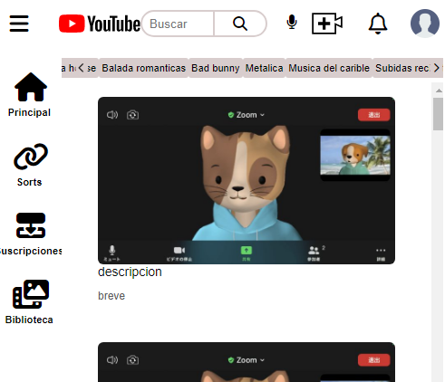

# yOutUbe clone practice✌✌

## Here, we're going to make a practice with a youtube's clone.

## We incluyed responsives features in the design 🦾 using media querys!!

## Until a design mobile style...📱📱

> The objetive here is practicing and practicing!💻💻

## Built With

- HTML
- CSS
- Link to other libraries!

## Authors

👤 **Reinaldo contreras**

- GitHub: [@sazuker](https://github.com/sazukeR)

👤 **Eduardo Hernandez Marin**

- GitHub: [@Edjhernandez](https://github.com/Edjhernandez)

## 🤝 Contributing

Contributions, issues, and feature requests are welcome!

## Show your support

Give a ⭐️ if you like this project!

## Acknowledgments

- Hat tip to anyone whose code was used
- Inspiration beginners

## 📝 License

This project is [MIT](./MIT.md) licensed.
